# Question 1 — Sourcing Methods for the Federer Profile

*Vaibhav Kumar Singh — DeepThought BA Assignment Part B*

---

## 🧭 The Framing Principle

> A standard Google search returns what companies **say about themselves**.
> The Federer profile is identified by what companies **spend money on** — land they acquire, technical talent they hire, and capital equipment they import.

The 12 methods are organized along this **triangulation logic**:

| Signal Axis | What It Measures | Why It Matters |
|-------------|-----------------|----------------|
| 🏗️ **Land** | Physical expansion | Companies don't buy land speculatively |
| 👷 **Labor** | Technical hiring | Hiring leads financials by 6–18 months |
| 💰 **Capital** | Machinery, IP, certifications | Expensive credentials = real commitment |

---

## 🗺️ Master Overview — 12 Methods by Tier

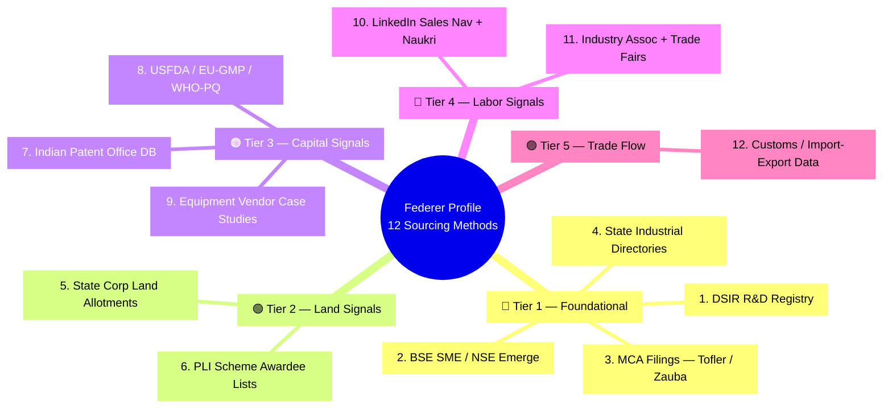

---

## 🔺 Triangulation Logic — How Signals Combine

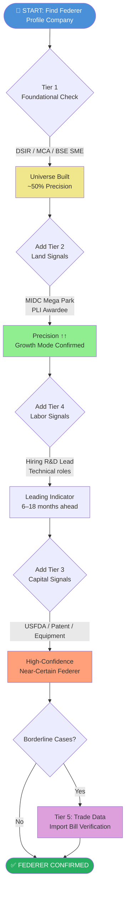

---

## 📊 Tier-by-Tier Precision Chart

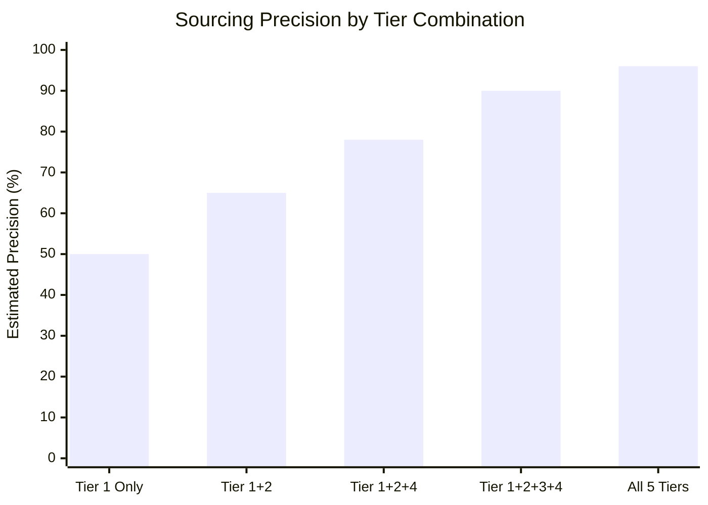

---

## 🔵 Tier 1 — Foundational Sources

> **Purpose:** Build the universe. Most candidates stop here — precision ~50%.

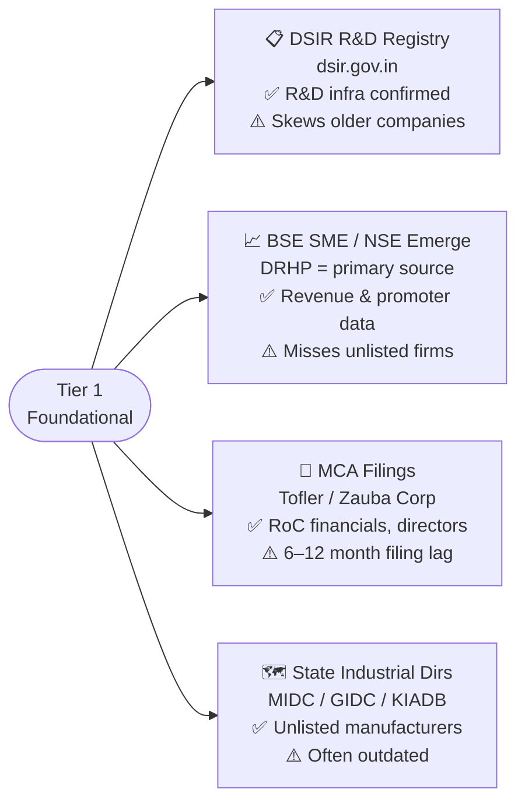

---

## 🟢 Tier 2 — Land Signals (Physical Expansion = Growth Proof)

> **Why high-signal:** Land allotment requires capital commitment and **18–36 month construction visibility**. Companies don't acquire industrial plots speculatively.

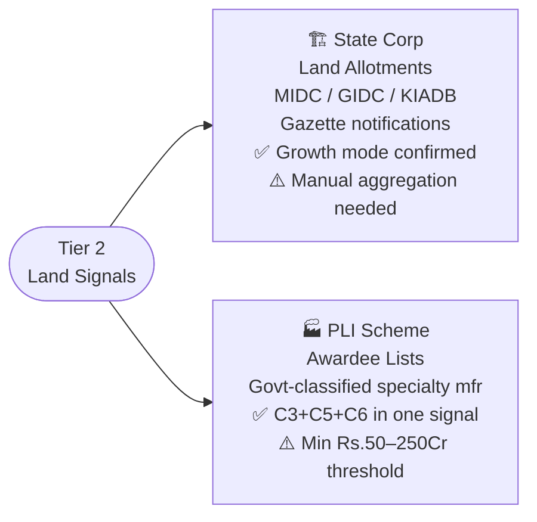

**Key Insight:**

| Signal | What it Proves | Criteria Satisfied |
|--------|---------------|-------------------|
| MIDC Mega Park Allotment | Active expansion, physical commitment | C6 — Growth |
| PLI Awardee | Govt-confirmed specialty classification + multi-year plan | C3 + C5 + C6 |
| AMTZ / Thematic Cluster | Segment auto-confirmed by cluster type | C3 — Differentiation |

---

## 🟠 Tier 3 — Capital Signals (Where the Money Actually Goes)

> **Why high-signal:** These signals are based on **revealed preference** — companies don't spend crores on certifications and patents without commercialisation intent.

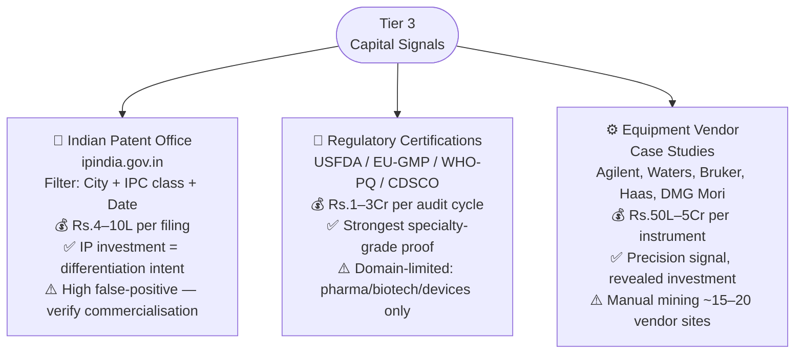

**Cost-as-Signal Table:**

| Credential / Equipment | Approx. Cost | What It Proves |
|----------------------|-------------|----------------|
| USFDA audit cycle | Rs. 1–3 Cr | International-grade quality system |
| NMR / HPLC-MS instrument | Rs. 50L–5 Cr | Analytical specialty capability |
| Patent filing (with agent) | Rs. 4–10 L | Active IP building |
| EU-GMP certification | Rs. 1–2 Cr | European export readiness |

---

## 🔴 Tier 4 — Labor Signals (Hiring = Leading Indicator)

> **Why high-signal:** Hiring decisions **lead financial reporting by 6–18 months**. Spotting an R&D Lead hire in October = 15-month advantage over waiting for FY25 annual report.

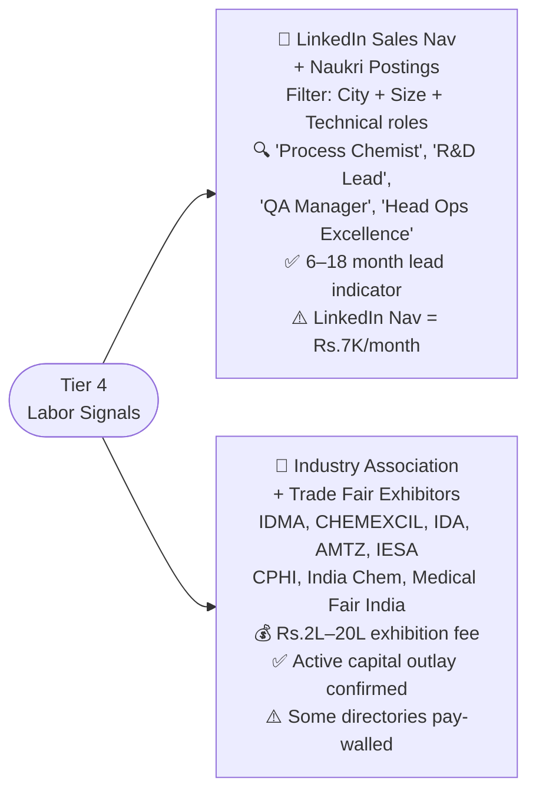

**Timing Advantage Diagram:**

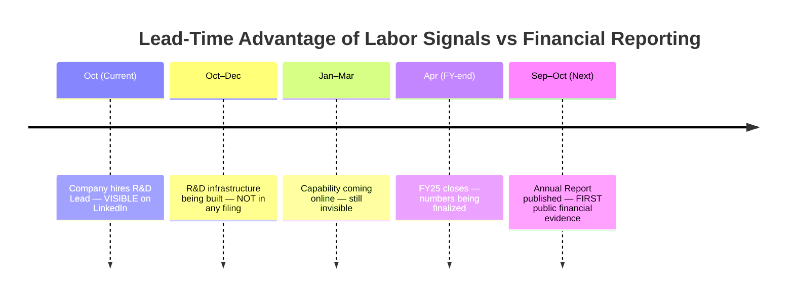

---

## 🟣 Tier 5 — Trade-Flow Signal

> **Use with compliance caveat.** Best used as a **verification layer**, not primary discovery.

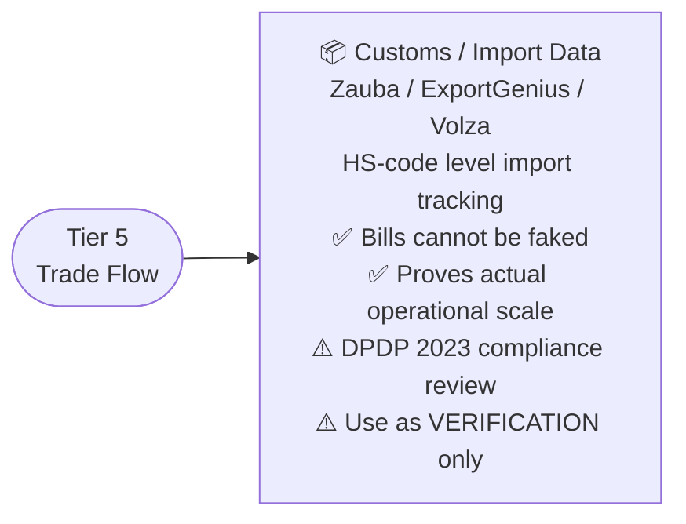

**Compliance Decision Tree:**

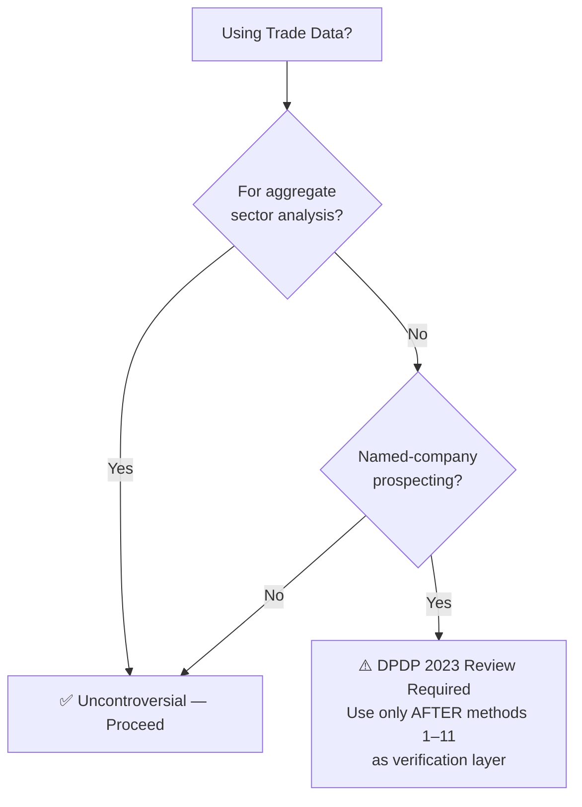

---

## 🧩 The Full Triangulation — Final Summary

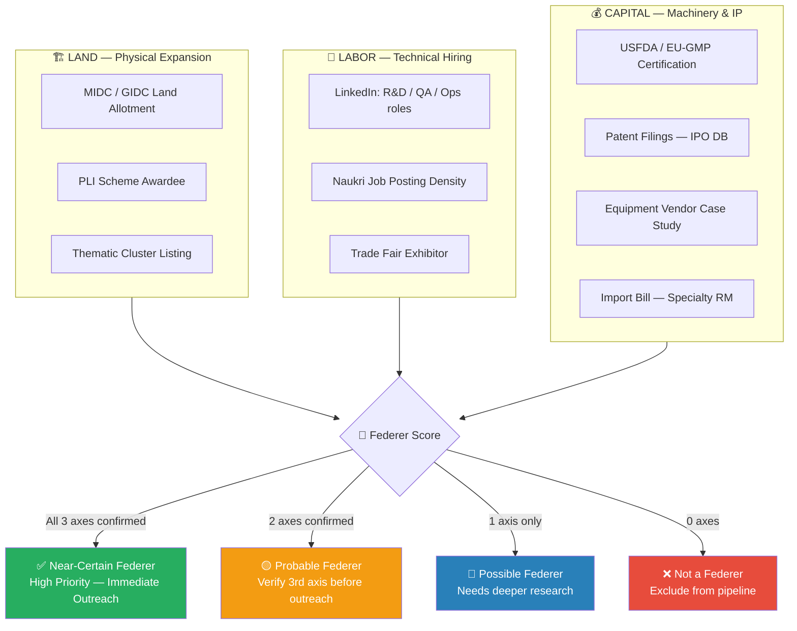

---

## ⚡ Quick Reference — All 12 Methods at a Glance

| # | Method | Axis | Precision | Cost | Lead Time |
|---|--------|------|-----------|------|-----------|
| 1 | DSIR R&D Registry | Foundational | Medium | Free | Lagging |
| 2 | BSE SME / NSE Emerge | Foundational | Medium | Free | Lagging |
| 3 | MCA Filings (Tofler) | Foundational | Medium | Free/Low | Lagging (6–12m) |
| 4 | State Industrial Dirs | Foundational | Low | Free | Lagging |
| 5 | Land Allotment Notices | 🏗️ Land | High | Free | Leading (18–36m) |
| 6 | PLI Awardee Lists | 🏗️ Land | Very High | Free | Leading |
| 7 | Patent Filings (IPO) | 💰 Capital | High | Free | Leading |
| 8 | USFDA / EU-GMP | 💰 Capital | Very High | Free | Current |
| 9 | Equipment Vendor Cases | 💰 Capital | High | Free | Current |
| 10 | LinkedIn + Naukri | 👷 Labor | High | Rs.7K/mo | Leading (6–18m) |
| 11 | Assoc. + Trade Fairs | 👷 Labor | Medium-High | Free/Paywalled | Current |
| 12 | Trade/Import Data | Trade Flow | Very High | Paid | Current |

---

*Methods listed in recommended sequence — Tiers 1–2 build the universe, Tier 3 enriches, Tier 4 confirms growth-mode, Tier 5 verifies operational reality.*

---
> 📝 **Prepared by:** Vaibhav Kumar Singh | DeepThought BA Assignment Part B
