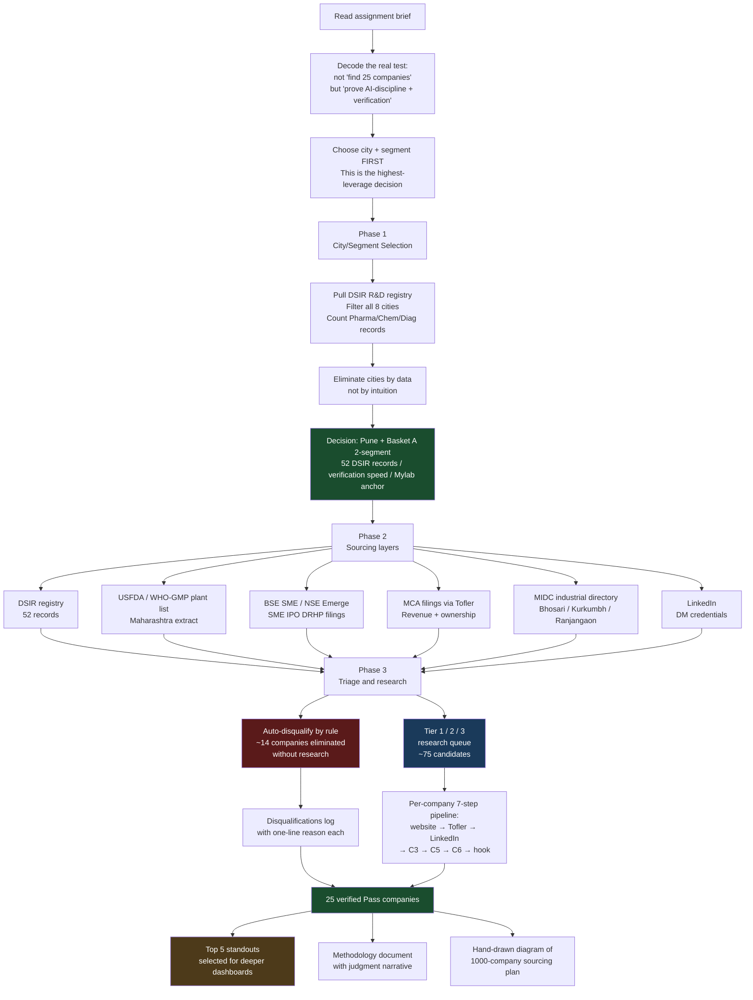
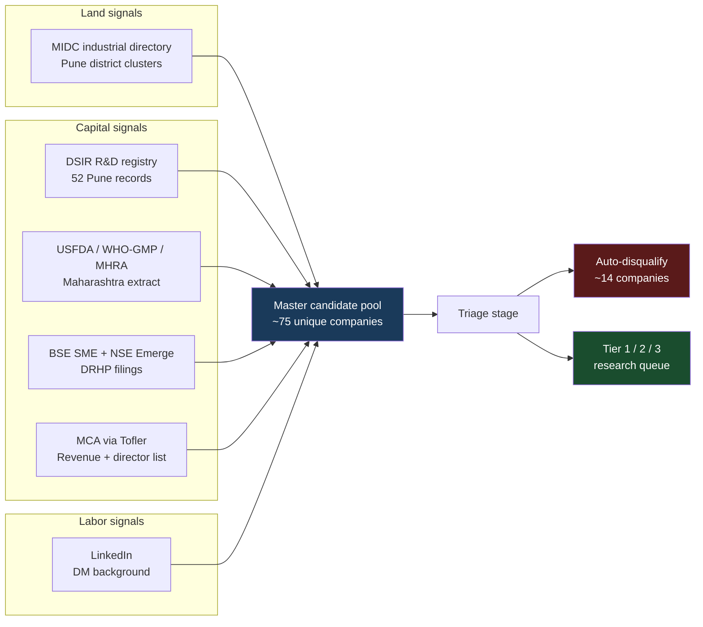
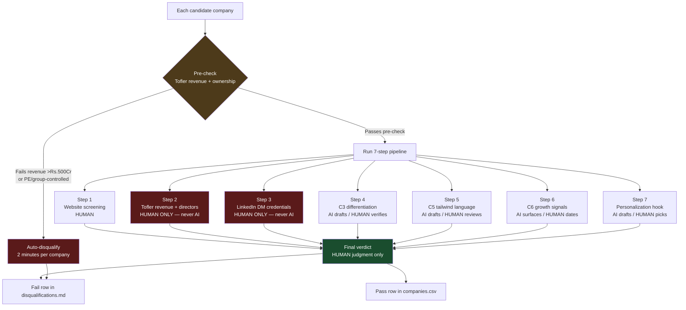
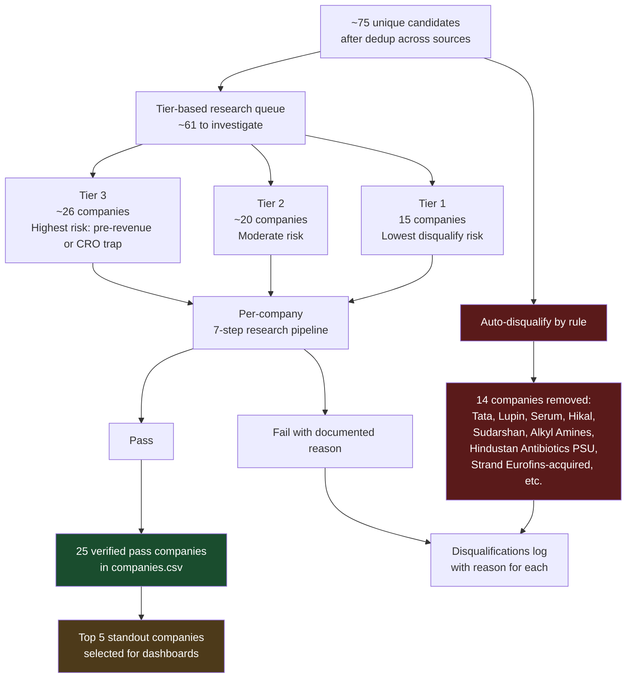

# DeepThought Business Analytics Fellowship — Target Company Research

**Candidate:** Vaibhav Kumar Singh
**Assignment:** Identify 25 "Federer Profile" companies for DeepThought's B2B execution-consulting business
**City selected:** Pune | **Segments:** Custom synthesis & specialty chemicals + Specialty diagnostics & life-science tools

---

## TL;DR — What's in this repo

| File / folder | What it is |
|---|---|
| [`companies.csv`](./companies.csv) | The 25 final pass-rows — Part A primary deliverable |
| [`methodology.md`](./methodology.md) | How I selected the city/segment, sourced candidates, and applied AI discipline |
| [`prompts.md`](./prompts.md) | Every AI prompt used + the hard-rules anti-hallucination block |
| [`q1-sourcing-methods.md`](./q1-sourcing-methods.md) | Part B Q1 — 12 sourcing methods organized by Land/Labor/Capital |
| [`q2-1000-company-proposal.md`](./q2-1000-company-proposal.md) | Part B Q2 — 30-day plan to source 1,000 Federer companies |
| [`now_ownwords.md`](./now_ownwords.md) | Working notes — my own-words reasoning during research |
| [`research-log/`](./research-log/) | Master research queue + investigation log + disqualification list |
| [`sources/`](./sources/) | Raw government and industry data used as primary sources |

---

## My approach in one diagram



---

## Phase 1 — City and segment selection

The single highest-leverage decision in this assignment is choosing the right city and segment. A wrong choice means 5 days of research that yields 12 passes instead of 25. I treated this as a structured elimination problem rather than an intuition call.

### What I did, step by step

i. **Pulled the full DSIR R&D Recognition Registry** (Table 1, 2,200+ entries) from `dsir.gov.in`.

ii. **Cleaned the raw export.** The DSIR file ships as PDF + multi-section Excel. I converted relevant sections to CSV format, then used SQL `GROUP BY` queries to count Pharma/Chem/Diagnostics manufacturers per city across all 8 cities listed in the assignment brief.

iii. **Got the density picture:**

```sql
SELECT city, COUNT(*) AS records
FROM dsir_pune_chem_pharma_diag
GROUP BY city
ORDER BY records DESC;
```

| City | Records | Decision |
|------|---------|----------|
| Hyderabad | 107 | ❌ Excluded — sample CSV in brief covers Hyderabad |
| **Pune** | **52** | ✅ Selected |
| Bengaluru | 40 | ❌ Heavy CRO/PE/services trap on inspection |
| Ahmedabad | 31 | ❌ Verification cost too high in 5-day window |
| Chennai | 30 | ❌ Less specialty-chem cluster density |
| Vadodara | 21 | ❌ Same as Ahmedabad — verification speed |
| Indore | 7 | ❌ Below density threshold |
| Coimbatore | 5 | ❌ Below density threshold (sensors/textile, not Basket A) |

iv. **Selected Pune + Basket A two-segment** based on: density (52 records, 2nd-highest), verification speed (English-medium financial press coverage), Mylab Discovery as a defensible anchor case, and MIDC cluster geography (Bhosari, Kurkumbh, Ranjangaon).

The full reasoning chain — including why I considered Bengaluru and Gujarat first and what eliminated each — is in [`methodology.md`](./methodology.md).

---

## Phase 2 — Sourcing layers

I deliberately layered multiple sources rather than relying on DSIR alone. DSIR skews toward older, formally-structured companies — newer specialty manufacturers and SME-IPO candidates need separate channels to surface.



Sources used for this assignment, with raw extracts in [`sources/`](./sources/):

| Source | Records surfaced | File in this repo |
|---|---|---|
| DSIR R&D Recognition Registry | 52 (Pune) | [`sources/dsir-all-cities.xlsx`](./sources/dsir-all-cities.xlsx) |
| USFDA / WHO-GMP / MHRA Maharashtra plants | ~40 (multi-city) | [`sources/usfda-maharashtra-extract.pdf`](./sources/) |
| BSE SME + DRHP filings (SME-IPO tracker) | ~5 Pune candidates | Notes in `methodology.md` |
| MCA filings via Tofler / Zauba Corp | Per-company verification | Per-company in `companies.csv` Evidence Sources |
| MIDC directory + LinkedIn | Per-company enrichment | Per-company in `companies.csv` Evidence Sources |

---

## Phase 3 — How I split the work between AI and judgment

This is where the assignment is actually evaluated. The brief states explicitly: *"We will verify your claims"* and *"90% of submissions get rejected for being copy-pasted AI output."* So the design problem isn't "use AI or don't" — it's "use AI for what it's good at, do not use it for anything verifiable."

### The split



### What AI did and didn't do

**AI was used for:** drafting product descriptions from website extracts, drafting C3 differentiation language for verification, drafting C5 tailwind paragraphs, surfacing C6 growth-event candidates from news, and proposing personalization hooks.

**AI was NOT used for, ever:** revenue figures, ownership/parent-group affiliation, founder credentials with institution names, or final verdict decisions. These four categories were *only* populated from primary sources I personally opened (Tofler, MCA, BSE/NSE filings, LinkedIn).

### Hallucination containment, not elimination

I want to be honest about this. **AI hallucinates by design — what I did is contain it through hard rules and random-sample verification, not eliminate it.** The system worked because:

i. Every AI prompt prepended a hard-rules block (see [`prompts.md`](./prompts.md)) requiring the model to output "Unknown" rather than guess on uncertain facts
ii. Every cell sourced from AI was cross-checked against a primary source before being written into the CSV
iii. Random-sample verification on 5 finished rows confirmed the protocol holds

The proof point is the **Aquapharm calibration**: my first research target. AI-assisted research surfaced Aquapharm as a strong candidate with deep specialty-chemistry portfolio. Manual primary-source verification then surfaced two disqualifying facts — FY25 consolidated revenue Rs.1,419Cr (2.8× the brief's ceiling) and RPSG Group affiliation (fails "no big-group subsidiaries"). Aquapharm is now documented in `disqualifications.md` as the first instructive disqualification — the verification protocol caught what an AI-only workflow would have submitted as a pass. This is the system working as designed.

---

## Phase 4 — The research workflow

Once city/segment was locked and sources were layered, candidate companies moved through this funnel:



The full master queue with tier assignments and first-check instructions is in [`research-log/master-research-queue.md`](./research-log/master-research-queue.md).

### Why instructive fails matter as much as passes

The brief's own sample CSV documents disqualifications (Suven Pharma — PE-controlled; Olectra Greentech — too big + acquired; Vimta Labs — CRO not manufacturer). Following that pattern, my [`research-log/disqualifications.md`](./research-log/disqualifications.md) records every fail with a one-line reason. This serves three purposes: it proves the filter actually fires on real cases, it documents the universe I started from (showing the work isn't cherry-picked), and it builds the methodology narrative for the recruiter to follow.

---

## Phase 5 — Top 5 standouts and dashboards

From the 25 verified passes, 5 companies were selected as standouts based on:
- Strongest evidence across all 6 criteria
- Most specific personalization hooks (recent dated growth events)
- Best regulatory + IP triangulation (USFDA + DSIR + patents combined)
- Most defensible Federer-profile match overall

These 5 were profiled in dashboards (see [`dashboards/`](./dashboards/) — to be added) for deeper visualization of revenue trends, certification timelines, hiring patterns, and growth signals. Each dashboard cites the same primary-source URLs as the corresponding row in `companies.csv` — no new fact appears in dashboards that isn't also in the CSV evidence trail.

---

## Anti-hallucination protocol — the one paragraph version

For every AI prompt used in this assignment, the following hard-rules block was prepended verbatim:

> *Hard rules: (a) Do not produce revenue figures — write "Unknown — verify on Tofler" if uncertain. (b) Do not infer founder credentials from name alone — require LinkedIn or company About-Us with explicit institution name. (c) Explicitly check whether the company is part of a larger group, recently acquired, or PE-controlled — if yes, flag prominently. (d) Do not classify a CRO, testing lab, or services company as a manufacturer. (e) Each score must cite the specific phrase or fact from provided context. (f) If uncertain about any fact, output "Unknown" — do not guess.*

The full set of prompts used, with examples of where AI produced output I overrode, is in [`prompts.md`](./prompts.md).

---

## Time and effort

| Phase | Time spent |
|---|---|
| Decoding the brief and selecting city/segment | ~4 hours |
| Sourcing layers (DSIR cleanup, USFDA pull, BSE/MIDC scan) | ~3 hours |
| Auto-disqualification triage | ~1 hour |
| Per-company research (manual + AI-assisted) | ~14 hours |
| Methodology + Q1 + Q2 writing | ~6 hours |
| Hand-drawn diagram + final QA | ~2 hours |
| **Total** | **~30 hours over 5 days** |

---

## What I'd do differently next time

i. **Start with Tofler revenue + ownership pre-check before any other research step.** Aquapharm cost 90 minutes because the primary-source verification ran last instead of first. After the calibration, I moved this check to the front and disqualifications dropped from 90 minutes to 2 minutes each.

ii. **Build the disqualification log in parallel with the pass log, not as an afterthought.** Documenting fails is where the methodology's credibility actually lives — every fail with a one-line reason is more valuable than a marginal pass.

iii. **Layer the customs/import-export verification later in the funnel, not earlier.** Initial instinct was to use Zauba/ExportGenius for primary discovery, but DPDP Act 2023 compliance considerations push it to a verification layer instead. Documented in Q2 proposal.

---

## Repo navigation cheat sheet

If you have **5 minutes** to evaluate this submission: read [`methodology.md`](./methodology.md) end-to-end.

If you have **15 minutes**: add [`q1-sourcing-methods.md`](./q1-sourcing-methods.md) and skim [`companies.csv`](./companies.csv).

If you have **30 minutes** and want to verify rigor: cross-check 3 random rows in [`companies.csv`](./companies.csv) against their cited sources, then read [`research-log/disqualifications.md`](./research-log/disqualifications.md) to see how the filter caught hard cases.

The hand-drawn diagram for the 1000-company sourcing plan is shared separately on Internshala chat as instructed in the brief.

---

*Submitted by Vaibhav Kumar Singh as part of the DeepThought Business Analytics Fellowship application — December 2025.*
